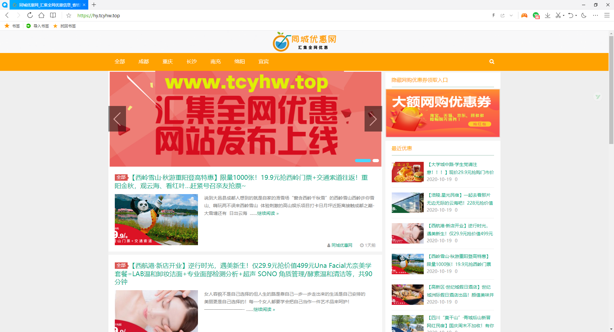
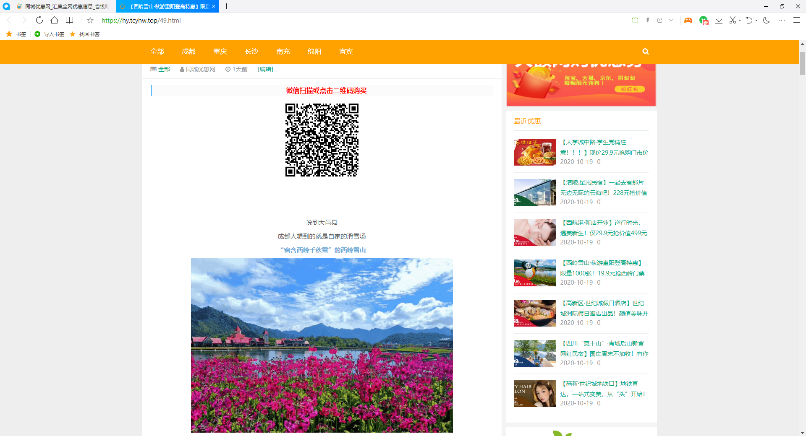
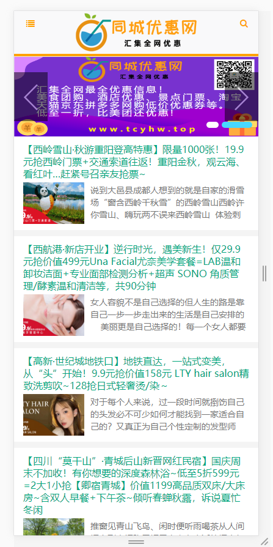
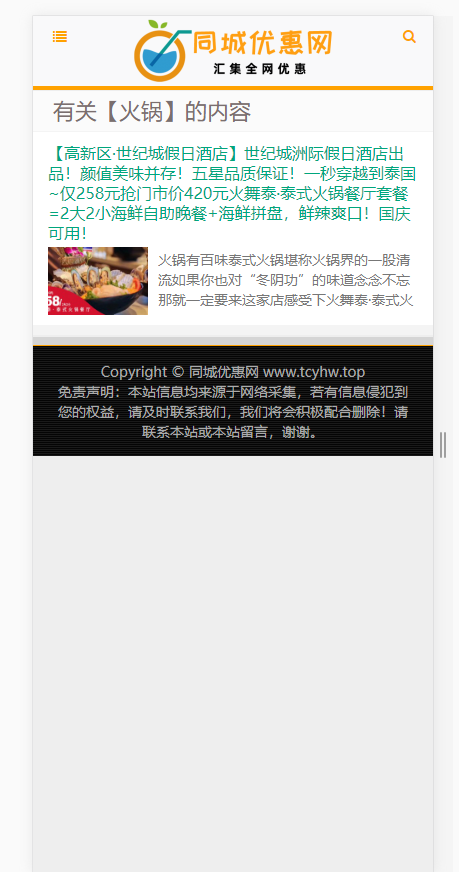
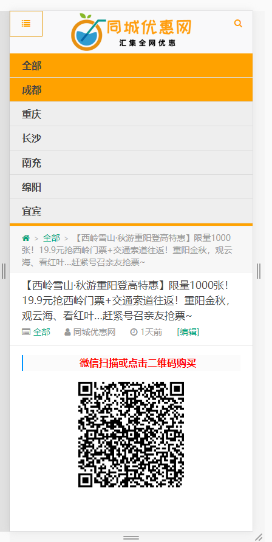

#tcyhw_wp_cms
基于wordpress 框架和 git主题修改。自适应手机端，支持搜索功能。已关闭评论/登录，需要的自己开启。
适用于新闻 资讯 CMS 商品展示。已发布到项目“同城优惠网”，配合小程序模板可以一键打包生成微信小程序/百度小程序等。 
演示地址:  hy.tcyhw.top  www.tcyhw.top
##PC端
###主页

###详情

##手机端

#使用教程
* clone 项目文件并上传指PHP目录
* 新建一个数据库，导入提供的sql文件进行初始化
* 修改数据库连接信息
   修改wp-config.php文件
   
   define('DB_NAME', '数据库名称');
   
   define('DB_USER', '用户名');
   
   define('DB_PASSWORD', '密码');
 * 后台地址为： http://IP:端口/wp-admin
    默认账号 mrguan/123456